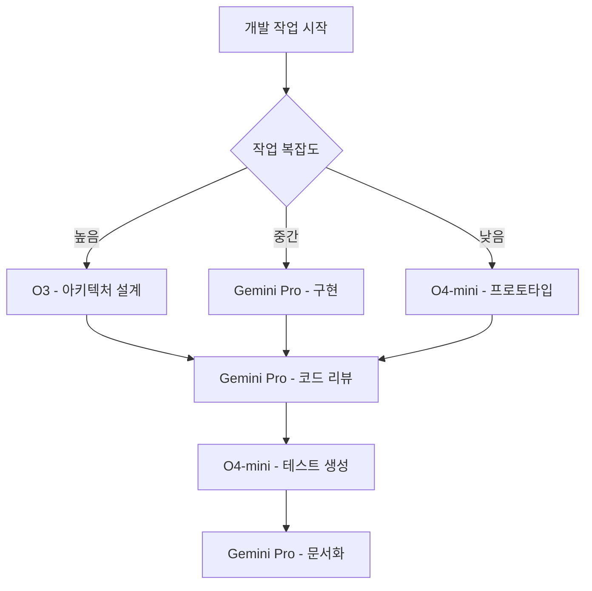

# BobCam iOS 개발 AI 워크플로우 전략

## 🤖 AI 모델별 역할 분담 및 활용 전략

### 📊 모델 특성 및 최적 활용 영역

| AI 모델 | 강점 | 최적 활용 영역 | 비용 효율성 |
|---------|------|----------------|-------------|
| **O3** | 복잡한 추론, 아키텍처 설계 | 시스템 설계, 성능 최적화, 보안 | 높은 비용 (신중 사용) |
| **Gemini Pro** | 코드 리뷰, 문서화, 균형적 분석 | 개발 실무, 통합 작업, 코드 품질 | 중간 비용 (주력 모델) |
| **O4-mini** | 빠른 응답, 간단한 작업 | 프로토타이핑, 테스트, 디버깅 | 낮은 비용 (자주 사용) |

---

## 🎯 개발 단계별 AI 활용 전략

### Phase 1: 사용자 검증 및 요구사항 분석 (2-3주)

#### Week 1-2: 사용자 리서치
```
Primary: Gemini Pro (문서 분석, 인터뷰 가이드 작성)
- 사용자 인터뷰 질문지 작성
- 경쟁 제품 분석 리포트
- 사용자 페르소나 정의

Secondary: O4-mini (빠른 아이디어 검증)
- 인터뷰 결과 요약
- 간단한 설문 조사 분석
- 아이디어 브레인스토밍
```

#### Week 3: 요구사항 정의
```
Primary: O3 (전략적 아키텍처 설계)
- 시스템 아키텍처 전체 설계
- 기술 스택 최종 검증
- 성능 요구사항 정의

Support: Gemini Pro (문서화)
- 요구사항 명세서 작성
- 기술 문서 정리
```

### Phase 2: iOS 네이티브 앱 개발 (8-10주)

#### Week 4-5: 프로젝트 초기 설정
```
Primary: O4-mini (빠른 프로토타이핑)
- Xcode 프로젝트 초기 설정
- 기본 UI 스켈레톤 코드
- 간단한 카메라 연동 테스트

Support: Gemini Pro (코드 리뷰)
- 프로젝트 구조 검토
- 코딩 스타일 가이드 적용
- 의존성 관리 최적화
```

#### Week 6-7: 핵심 알고리즘 구현
```
Primary: O3 (복잡한 알고리즘 설계)
- Python → Swift 알고리즘 포팅 전략
- Core ML 최적화 방안
- 실시간 성능 최적화 아키텍처

Secondary: Gemini Pro (구현 및 검증)
- 실제 Swift 코드 구현
- 코드 리뷰 및 리팩토링
- 단위 테스트 작성

Tertiary: O4-mini (디버깅)
- 빠른 버그 수정
- 간단한 기능 구현
- 테스트 케이스 생성
```

#### Week 8-9: UI/UX 완성
```
Primary: Gemini Pro (UI 개발 및 통합)
- SwiftUI 컴포넌트 구현
- 사용자 인터페이스 최적화
- 접근성 기능 구현

Support: O4-mini (빠른 UI 반복)
- UI 프로토타입 빠른 생성
- 디자인 시스템 적용
- 간단한 애니메이션 구현
```

#### Week 10-11: 성능 최적화
```
Primary: O3 (고급 최적화)
- Metal Performance Shaders 활용
- 메모리 관리 최적화
- 배터리 효율성 극대화

Secondary: Gemini Pro (성능 측정)
- 프로파일링 코드 작성
- 성능 지표 수집 시스템
- 최적화 결과 검증
```

#### Week 12: 베타 테스트
```
Primary: Gemini Pro (테스트 자동화)
- UI 테스트 스위트 작성
- TestFlight 배포 자동화
- 버그 트래킹 시스템

Support: O4-mini (빠른 버그 수정)
- 간단한 버그 픽스
- 테스트 케이스 추가
- 사용자 피드백 반영
```

---

## 🛠️ Zen MCP 도구별 AI 배분 전략

### 코드 개발 워크플로우


### zen:analyze (코드 분석)
- **Gemini Pro**: 일반적인 코드 품질 분석
- **O3**: 복잡한 성능 분석, 아키텍처 검토
- **O4-mini**: 빠른 문법 검사, 간단한 코드 스멜 감지

### zen:codereview (코드 리뷰)
- **Gemini Pro**: 표준 코드 리뷰 (보안, 가독성, 유지보수성)
- **O3**: 중요한 모듈의 심층 보안 검토
- **O4-mini**: 간단한 스타일 가이드 검사

### zen:debug (디버깅)
- **O3**: 복잡한 버그, 성능 이슈, 메모리 누수
- **Gemini Pro**: 일반적인 로직 오류, 통합 이슈
- **O4-mini**: 간단한 버그, 문법 오류

### zen:testgen (테스트 생성)
- **Gemini Pro**: 통합 테스트, UI 테스트
- **O4-mini**: 단위 테스트, 간단한 테스트 케이스
- **O3**: 복잡한 시나리오 테스트, 성능 테스트

### zen:refactor (리팩토링)
- **O3**: 대규모 아키텍처 리팩토링
- **Gemini Pro**: 모듈별 코드 개선
- **O4-mini**: 간단한 코드 정리

---

## 💰 비용 최적화 전략

### 비용 효율적 AI 사용 패턴

#### 일반 개발 작업 (80% - 저비용)
```
O4-mini (50%) + Gemini Pro (30%) 조합
- 빠른 프로토타이핑과 일반적인 개발
- 코드 리뷰와 문서화
- 단위 테스트와 간단한 디버깅
```

#### 중요 설계 결정 (15% - 중간비용)
```
Gemini Pro 중심 + O3 검증
- 아키텍처 초안은 Gemini Pro
- 최종 검증만 O3 활용
- 성능 임계 섹션 설계
```

#### 고급 최적화 (5% - 고비용)
```
O3 전용 사용
- Core ML 모델 최적화
- Metal 셰이더 최적화
- 배터리 효율성 극대화
- 보안 크리티컬 섹션
```

### 비용 모니터링 및 제어
- **주간 비용 한도**: O3 ($50), Gemini Pro ($100), O4-mini ($30)
- **우선순위 기반 할당**: 핵심 기능 > 부가 기능 > 편의성 개선
- **대안 전략**: O3 한도 초과 시 Gemini Pro로 대체

---

## 📋 실제 작업 예시

### 1. 립 트래킹 알고리즘 구현 예시

#### Step 1: 아키텍처 설계 (O3)
```
zen:thinkdeep with O3
"Python MediaPipe 립 트래킹 알고리즘을 Swift+Core ML로 포팅하는 
최적의 아키텍처를 설계해줘. 특히 실시간 성능과 배터리 효율성을 
고려한 데이터 파이프라인을 중심으로 분석해줘."
```

#### Step 2: 구현 (Gemini Pro)
```
zen:chat with Gemini Pro
"O3가 설계한 아키텍처를 바탕으로 Swift 코드를 구현해줘. 
Vision Framework의 VNFaceLandmarkRegion2D를 활용해서 
립 포인트를 추출하고 거리 계산하는 코드를 작성해줘."
```

#### Step 3: 테스트 생성 (O4-mini)
```
zen:testgen with O4-mini
"립 트래킹 알고리즘에 대한 포괄적인 단위 테스트를 생성해줘. 
다양한 얼굴 각도와 조명 조건에서의 테스트 케이스를 포함해줘."
```

#### Step 4: 최적화 (O3)
```
zen:analyze with O3
"구현된 립 트래킹 코드의 성능을 분석하고, Metal을 활용한 
GPU 가속 방안을 제시해줘. 특히 iPhone 13 Pro의 Neural Engine 
활용 방안을 중심으로 최적화해줘."
```

### 2. UI 컴포넌트 개발 예시

#### Step 1: 프로토타입 (O4-mini)
```
zen:chat with O4-mini
"SwiftUI로 실시간 카메라 프리뷰와 비디오 플레이어를 
나란히 표시하는 기본 UI를 만들어줘."
```

#### Step 2: 개선 및 통합 (Gemini Pro)
```
zen:refactor with Gemini Pro
"O4-mini가 만든 UI 코드를 개선해서 접근성 지원, 
Dynamic Type, 다크 모드를 지원하도록 리팩토링해줘."
```

#### Step 3: 검증 (Gemini Pro)
```
zen:codereview with Gemini Pro
"UI 코드가 Apple Human Interface Guidelines를 
준수하는지 검토하고 개선사항을 제안해줘."
```

---

## 🔄 지속적 개선 프로세스

### 주간 AI 효율성 리뷰
- **월요일**: 주간 개발 계획에 따른 AI 역할 분담
- **수요일**: 중간 점검 및 AI 사용량 모니터링
- **금요일**: 주간 성과 리뷰 및 다음 주 전략 조정

### 모델 성능 평가 지표
- **응답 품질**: 코드 정확성, 설명 명확성 (1-10점)
- **비용 효율성**: 목표 달성 대비 비용 ($/기능)
- **개발 속도**: 작업 완료 시간 단축률 (%)

### 학습 및 개선
- **성공 패턴 문서화**: 효���적인 AI 활용 사례 수집
- **실패 사례 분석**: 비효율적 사용 패턴 개선
- **팀 지식 공유**: AI 활용 노하우 공유 세션

---

## 🎯 핵심 성공 요소

### 적절한 모델 선택 기준
1. **복잡도**: 단순(O4-mini) → 일반(Gemini Pro) → 복합(O3)
2. **중요도**: 실험적(O4-mini) → 핵심(Gemini Pro) → 크리티컬(O3)
3. **시간압박**: 급함(O4-mini) → 보통(Gemini Pro) → 신중(O3)

### 효과적인 프롬프트 전략
- **구체적 컨텍스트**: 항상 프로젝트 배경과 제약사항 명시
- **예상 결과물**: 원하는 결과의 형태와 범위 구체화
- **검증 기준**: 성공/실패를 판단할 수 있는 명확한 기준 제시

### 품질 보증 프로세스
- **멀티 모델 검증**: 중요한 결정은 2개 이상 모델로 교차 검증
- **점진적 개선**: 빠른 프로토타입 → 지속적 개선 사이클
- **실제 테스트**: AI 제안을 실제 환경에서 반드시 검증

---

*최종 업데이트: $(date)*
*관련 문서: iOS-Development-TODO.md*